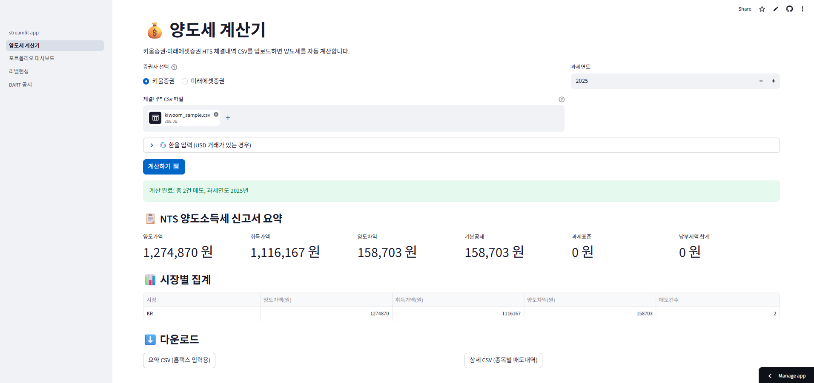

# SentinelQ

**KR 개인 투자자를 위한 세금·공시 자동화 도구.** 해외주식 양도세 신고, 세후
수익률 추적, DART 공시 모니터링을 한 곳에서 처리합니다.

[](https://sentinelq.streamlit.app/)


> 매년 5월 해외주식 양도세를 증권사별로 따로 계산하고, 손익통산을 손으로
> 맞추는 게 번거롭다면 — 이 도구가 그 작업을 자동화합니다.

**설치 없이 웹에서 바로 사용:** https://sentinelq.streamlit.app/

---

## 무엇을 하나

| 기능 | 설명 |
|---|---|
| 💰 **양도세 계산기** | 여러 증권사 거래내역 CSV를 통합 → FIFO 손익통산 + 250만원 기본공제 + 22% 세율 자동 계산 → 국세청(NTS) 신고 양식 출력 |
| 📈 **포트폴리오 대시보드** | 보유 종목의 세전·세후 수익률 비교, 예상 양도세, 잔여 기본공제 추적 |
| ⚖️ **리밸런싱 계산기** | 목표 자산 배분 대비 이탈도 계산 + 매도 시 발생 세금 안분 |
| 🔔 **DART 공시 모니터링** | 보유 종목의 신규 공시(유상증자·합병·상장폐지 등)를 조회하고 텔레그램으로 알림 |

알파 발견·자동매매·시장 타이밍 기능은 **없습니다.** 이 도구는 세금·공시 등
반복 사무 작업의 자동화만 다룹니다.

## 스크린샷

<!-- docs/screenshots/ 에 이미지 추가 후 아래 경로 연결 -->
<!--  -->
_(스크린샷 추가 예정)_

## 빠른 시작

```bash
# 1. 클론
git clone https://github.com/illenne77/SentinelQ.git
cd SentinelQ

# 2. 설치 (Python 3.11+)
python -m venv .venv
.venv/Scripts/Activate.ps1        # Windows PowerShell
pip install -e ".[ui]"

# 3. 웹 앱 실행
streamlit run streamlit_app.py --server.address 127.0.0.1
```

브라우저에서 `http://127.0.0.1:8501` 접속.

> Windows 11에서 `--server.address localhost`는 IPv6(::1)로 바인딩되어
> 접속이 안 될 수 있습니다. `127.0.0.1` 또는 `0.0.0.0`을 사용하세요.

## 지원 증권사

| 증권사 | 거래내역 CSV | 잔고 자동 조회 |
|---|---|---|
| 키움증권 | ✅ | — |
| 미래에셋증권 | ✅ | — |
| 한국투자증권(KIS) | ✅ | ✅ (OpenAPI) |
| NH·삼성·기타 | 🙏 기여 환영 | — |

다른 증권사 CSV 파서 추가는 [CONTRIBUTING.md](CONTRIBUTING.md)를 참고하세요.

## API 키 설정 (선택)

DART 공시·KIS 잔고 조회·텔레그램 알림 기능은 API 키가 필요합니다. 양도세
계산기와 리밸런싱은 키 없이 동작합니다.

`.env` 파일을 만들어 설정합니다 ([.env.example](.env.example) 참고):

```
DART_API_KEY=...          # DART 공시 (opendart.fss.or.kr 무료 발급)
KIS_APP_KEY=...           # KIS 잔고 자동 조회 (선택)
KIS_APP_SECRET=...
TELEGRAM_BOT_TOKEN=...    # 공시 알림 (선택)
TELEGRAM_CHAT_ID=...
```

## CLI 도구

웹 앱 없이 명령줄에서도 사용할 수 있습니다.

```bash
python scripts/run_tax_report.py --year 2025          # 양도세 신고서
python scripts/run_portfolio.py                       # 포트폴리오 세후 수익률
python scripts/run_rebalance.py --target KR=30 US=70  # 리밸런싱 계획
python scripts/run_dart_monitor.py --days 7 --notify  # DART 공시 + 텔레그램 알림
```

## 면책 (Disclaimer)

이 도구는 **참고용 계산기**입니다. 출력된 양도세 금액은 신고를 돕기 위한
추정치이며, 법적 효력이 있는 세무 자문이 아닙니다. 실제 신고 전 반드시
국세청 홈택스 또는 세무 전문가를 통해 확인하시기 바랍니다. 이 소프트웨어
사용으로 발생한 어떤 손해에 대해서도 작성자는 책임지지 않습니다(MIT License).

## 기여

증권사 CSV 파서 추가, 버그 제보, 세법 엣지케이스 개선 등 기여를
환영합니다. [CONTRIBUTING.md](CONTRIBUTING.md)를 참고하세요.

## 개발

```bash
pip install -e ".[dev,ui]"
pytest tests/ -v          # 테스트 (421 passed)
ruff check sentinelq/     # 린트
```

## 프로젝트 히스토리

SentinelQ는 원래 KR 주식 알파 사냥(시스템 트레이딩) 프로젝트로
2025-11에 시작했습니다. 6개월간 알파 후보 8개를 검증했으나 모두 실패했고,
그 과정과 종료 결정은 [`docs/adr/`](docs/adr/)에 13건의 ADR로 기록되어
있습니다. 2026-05 현재는 그때 축적한 인프라(KIS·DART 어댑터, 포트폴리오
부기)를 재활용해 **세금·공시 자동화 도구**로 전환했습니다. 자세한 배경은
[ADR-0013](docs/adr/ADR-0013-phase3-kr-investor-tools.md)을 참고하세요.

## 라이선스

[MIT](LICENSE) © 2026 illenne77
